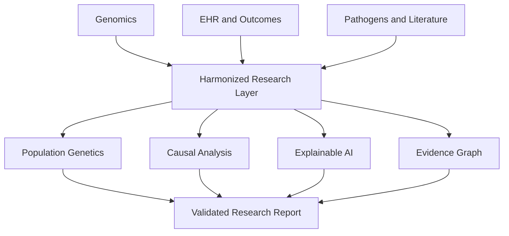

# ABO-EvoHealth AI

<p align="center">
  <strong>An ancestry-aware bioinformatics and health-informatics platform for studying ABO biology, infection, and vascular risk.</strong>
</p>

<p align="center">
  <a href="https://github.com/mtariqi/abo-evohealth-ai/actions"></a>
  
  
  
</p>

> [!IMPORTANT]
> This repository is a research prototype. It does not diagnose disease, guide transfusion, or provide personalized medical advice.

## Why this project exists

Popular accounts often turn ABO biology into a simple story: type O is “ancestral,” smooth red cells block pathogens, and blood type predicts health. The real biology is more interesting. ABO is an ancient polymorphic system; common O alleles usually encode inactive glycosyltransferase; infection effects depend on pathogen strain, tissue glycans, exposure, and FUT2/FUT3 status; and vascular associations must be separated from individual clinical utility.

ABO-EvoHealth AI makes those claims testable using population genomics, longitudinal health data, causal inference, interpretable machine learning, and a provenance-aware evidence graph.

## Research questions

1. Does ABO genotype add reproducible information to severe-malaria, severe-cholera, norovirus, VTE, or bleeding models?
2. Are signals stable across genetic ancestry, geography, site, time, and pathogen strain?
3. Are associations mediated or modified by FUT2/FUT3, VWF/FVIII, exposure, or treatment?
4. Does ABO improve calibration or clinical net benefit beyond conventional predictors?

## Architecture



## Included in this starter repository

- Deterministic synthetic cohort generator with ABO, ancestry, clinical, biomarker, and outcome fields
- Schema and category validation
- Leakage-safe preprocessing with one-hot encoding inside a scikit-learn pipeline
- Nested baseline models that quantify the incremental contribution of ABO
- Patient-grouped train/test splitting
- AUROC, AUPRC, Brier score, calibration slope/intercept, and groupwise metrics
- Command-line interface and YAML configuration
- Unit and integration tests
- GitHub Actions continuous integration
- Model card, data sheet, statistical analysis plan, roadmap, and contribution guide

## Quick start

```bash
git clone https://github.com/mtariqi/abo-evohealth-ai.git
cd abo-evohealth-ai
python -m venv .venv
source .venv/bin/activate
python -m pip install --upgrade pip
pip install -e ".[dev]"
abo-evohealth demo --config configs/demo.yaml
pytest
```

Generated demonstration outputs appear under `outputs/demo/`:

- `synthetic_cohort.csv`
- `model_comparison.csv`
- `group_metrics.csv`
- `run_metadata.json`

## Modeling ladder

| Model | Features | Purpose |
|---|---|---|
| M0 | Age, sex, BMI, smoking, cancer, surgery, anticoagulant use | Clinical baseline |
| M1 | M0 + site and ancestry | Context and stratification control |
| M2 | M1 + ABO phenotype | Incremental ABO value |
| M3 | M2 + FUT2, VWF, factor VIII | Mechanistic extension |

The demonstration predicts a synthetic VTE outcome. Synthetic data validate software behavior, not scientific validity.

## Repository map

```text
configs/                 Analysis configuration
docs/                    Governance and research documentation
src/abo_evohealth/       Installable Python package
tests/                   Unit and end-to-end tests
.github/workflows/       Continuous integration
outputs/                 Generated files; ignored by Git
```

## Scientific safeguards

- Never infer race from ABO.
- Never recommend a blood-type diet.
- Keep ancestry, geography, and social variables conceptually distinct.
- Use validated haplotype-aware ABO calling for real genomic data.
- Separate infection acquisition from severity.
- Include FUT2 and pathogen genotype in norovirus analyses.
- Use external and temporal validation before any prospective evaluation.
- Report null findings and subgroup uncertainty.

## Development roadmap

See [docs/ROADMAP.md](docs/ROADMAP.md) for the staged path from this synthetic demonstrator to population-genomic and controlled-clinical validation.

## Citation

If you use this project, cite the repository metadata in [CITATION.cff](CITATION.cff). Scientific references are listed in [docs/REFERENCES.md](docs/REFERENCES.md).

## License

Code is released under the MIT License. Dataset licenses and controlled-data agreements remain separate and must be followed.

